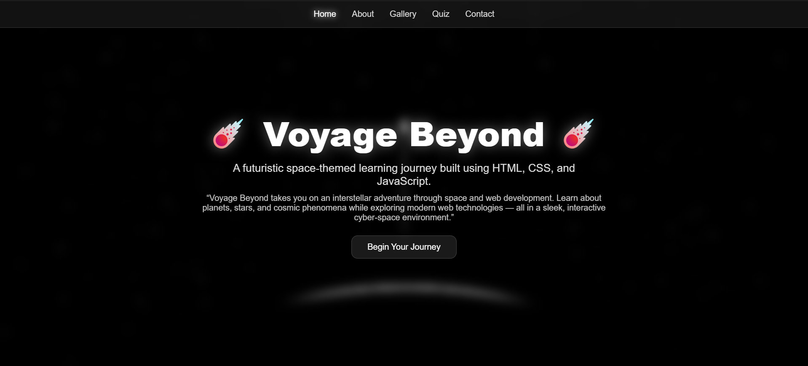
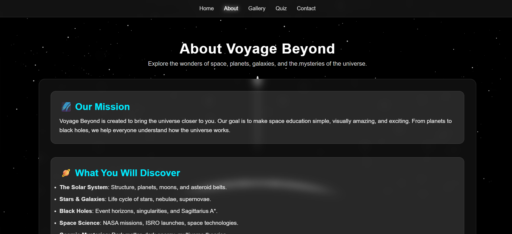
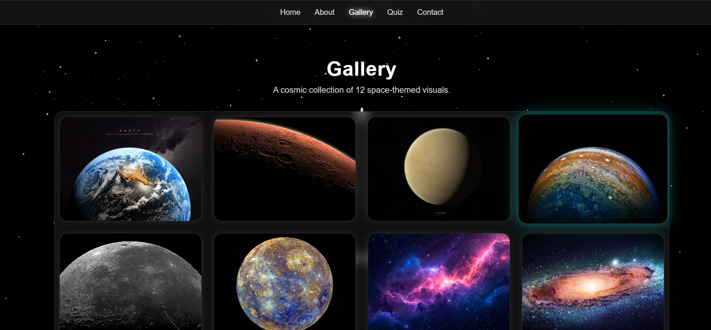
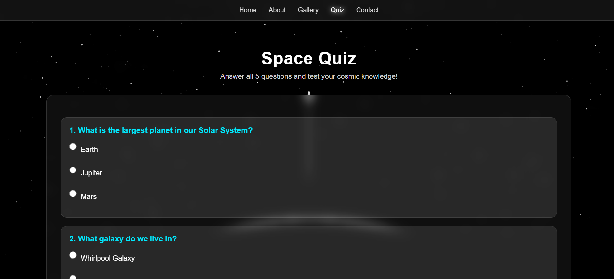
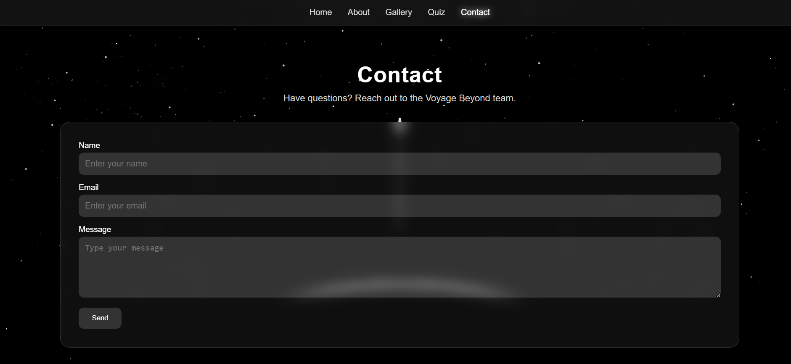

<div align="center">

# ☄️ Voyage Beyond ☄️

### *A Futuristic Space-Themed Learning Experience Built with HTML, CSS & JavaScript*

<p>
Explore the mysteries of the universe through an interactive, visually stunning website featuring planets, galaxies, quizzes, and immersive space-themed design.
</p>


</div>

---

# 🌌 About the Project

**Voyage Beyond** is a futuristic, space-inspired educational website designed to make learning about the universe exciting and interactive.

The website combines a sleek dark-space interface with modern web technologies to create an engaging experience where users can explore fascinating topics such as planets, galaxies, black holes, and space science.

It also includes an interactive quiz, a visual gallery, and a contact page to provide a complete multi-page web experience.

---

# ✨ Features

- 🚀 Modern Space-Themed UI
- 🌠 Glassmorphism Inspired Design
- 🌍 Responsive Multi-Page Website
- 🪐 Educational Space Content
- 🖼️ Interactive Space Gallery
- 🧠 Space Quiz
- 📩 Contact Form
- 💻 Built using Pure HTML, CSS & JavaScript
- 🌌 Smooth User Experience

---

# 🛠️ Technologies Used

| Technology | Purpose |
|------------|---------|
| HTML5 | Website Structure |
| CSS3 | Styling & Responsive Design |
| JavaScript | Interactivity & Quiz Logic |

---

# 📂 Project Structure

```text
Voyage-Beyond/
│
├── index.html
├── about.html
├── gallery.html
├── contact.html
├── quiz.html
│
├── style.css
├── gallery.js
├── quiz.js
│
├── screenshots/
│   ├── home.png
│   ├── about.png
│   ├── gallery.png
│   ├── quiz.png
│   └── contact.png
│
└── README.md
```

---

# 📸 Website Preview

## 🏠 Home



---

## 📖 About



---

## 🖼️ Gallery



---

## 🧠 Quiz



---

## 📩 Contact



---

# 🚀 Getting Started

## Clone the Repository

```bash
git clone https://github.com/RakeshX0925/Voyage-Beyond.git
```

## Navigate to the Project

```bash
cd Voyage-Beyond
```

## Run the Website

Simply open:

```text
index.html
```

in your favorite web browser.

---

# 🎯 Website Pages

🏠 Home

- Landing page with futuristic design
- Introduction to the project

📖 About

- Mission of Voyage Beyond
- Space learning overview
- Educational information

🖼️ Gallery

- Beautiful collection of space-themed images
- Interactive hover effects

🧠 Quiz

- Test your knowledge of space
- Interactive multiple-choice questions

📩 Contact

- Contact form
- Clean user-friendly interface

---

# 📚 What I Learned

While building this project, I gained practical experience in:

- Building multi-page websites
- Responsive web design
- CSS Flexbox & Layouts
- Glassmorphism UI Design
- JavaScript DOM Manipulation
- Event Handling
- Project Organization
- Git & GitHub Version Control

---

# 🚀 Future Improvements

- 🌌 NASA API Integration
- 🌍 3D Solar System
- 🚀 Animated Rocket Launch
- 🌠 Dynamic Star Background
- 🛰️ Planet Search
- 🌙 Dark / Light Theme
- 🏆 Quiz Leaderboard
- 👤 User Login System
- 📱 Progressive Web App (PWA)

---

# 🤝 Contributing

Contributions are welcome!

If you'd like to improve this project:

1. Fork the repository
2. Create a new branch
3. Commit your changes
4. Push to your branch
5. Open a Pull Request

---

# 👨‍💻 Author

## **Rakesh**

**B.Tech – Computer Science & Engineering (Cyber Security)**

Passionate about

- 🌐 Web Development
- 🔐 Cyber Security
- 💻 Programming
- 🚀 Technology

GitHub: **YOUR_GITHUB_USERNAME**

---

# ⭐ Show Your Support

If you enjoyed this project,

⭐ **Give this repository a Star!**

It motivates me to build more exciting projects.

---

<div align="center">

## 🌌 "The universe is infinite... so is the journey of learning."

### 🚀 Happy Coding! 🚀

</div>
